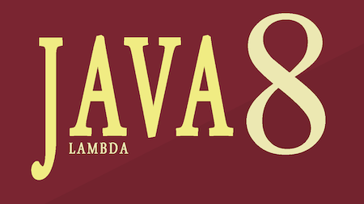

# Java-8-lambda
Expressões Lambda com Java 8

 

> Formadora: **eXcript** 
> Site: http://excript.com 
> Canal do Youtube: https://www.youtube.com/watch?v=q84ncDh4ln0&list=PLesCEcYj003SbwnNhQ9eyF7IjPlEK0uVg 

*Tempo de Curso: (+ou-) 14 minutos*

## Ementa do mini curso:

* Aula 01: Introdução ao Java 8

    ***Duração:** 4:18 minutos*

* Aula 02: Expressões Lambdas

    ***Duração:** 5:45 minutos*

* Aula 03: Expressões Lambdas na Prática

    ***Duração:** 5:52 minutos*

* Aula 04: Sintaxe do Lambada

    ***Duração:** 3:26 minutos*

* Aula 05: Interfaces Funcionais

    ***Duração:** 4:07 minutos*

* Aula 06: Expressões Lambdas II  

    ***Duração:** 4:04 minutos*

* Aula 07: Expressões Lambdas III

    ***Duração:** 6:09 minutos*

* Aula 08: Stream

    ***Duração:** 4:41 minutos*

* Aula 09: Stream na Prática

    ***Duração:** 5:06 minutos*

* Aula 10: Interface Funcional Predicate

    ***Duração:** 7:17 minutos*

* Aula 11: Iteração Interna

    ***Duração:** 6:13 minutos*

* Aula 12: Iteração Interna II

    ***Duração:** 4:50 minutos*
